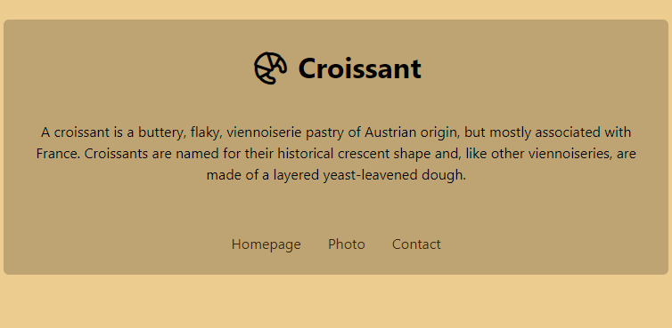

# SheCodes exercise: Website about croissants

This is an exercise from the [SheCodes Responsive workshop](https://www.shecodes.io/responsive).
  [Verified Certificate](https://www.shecodes.io/certificates/c8c795b9043726d5311122ac2ce45a50)

Built with HTML and CSS.
 Hosted on Netlify.

[Live Site URL](https://eloquent-lovelace-a94eda.netlify.app/)

## Screenshot

